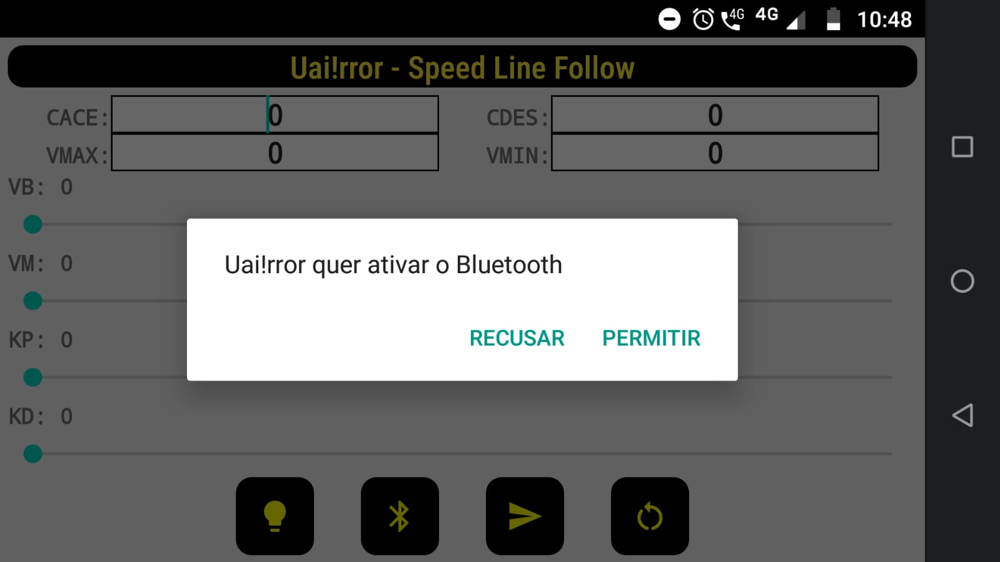
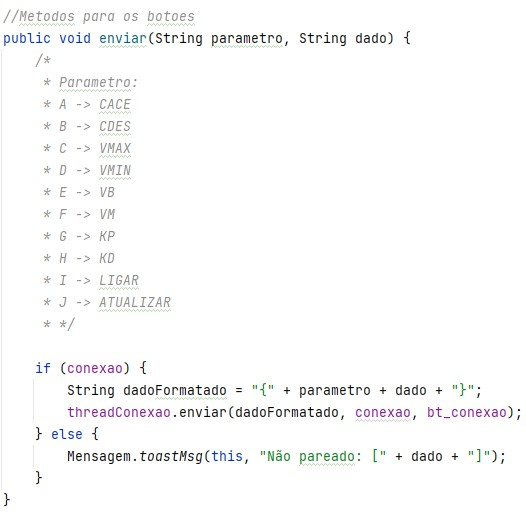

<h1 align="center">🤖 Uai!rror | Speed Line Follow 🔥</h1>

Aplicativo Android desenvolvido para a equipe de robótica Uai!rror para telemetria de robôs seguidores de linha.

## 📋 Sobre

Em geral, robôs seguidores de linha utilizam controle PID e umas das melhores técnicas é testar as constantes em ação, mas sem uma ferramenta que agilize o processo isso se torna tedioso e cansativo (tirando toda a alegria que a robótica proporciona 😄). Pensando nisso, desenvolvi junto a equipe Uai!rror um App Android, que se comunica via bluetooth com o robô, e muda parâmetros internos de sua programação quando o mesmo está correndo em pista. Gostaria de agradecer a <b>Lucas Martins 😎</b> pelo apoio prestado e o empréstimo de materiais, desejo muito sucesso em suas competições.

  
  

## 📁 uairror-speed-line-follow-test
Dentro dessa pasta temos o código fonte do arduino, com a finalidade de testar o app. Esse código recebe dados enviados pelo App através do Módulo HC-05. Tais dados são separados em blocos para melhor comunicação. Uma vez que os dados são recebidos e separados, os respectivos parâmetros são alterados em tempo de execução. Parece mágica 🤣 mas é apenas o Socket trabalhando.

## ❔ Explicando os Parametros

Quando falamos em comunicação quando menos bytes enviamos melhor, então para isso criamos uma tabela de códigos apenas uma letra vai ditar o parâmetro que deve ser alterado no momento. Parece complicado? 🤔 Mas olha a imagem abaixo. Podemos ver que cada valor que pode ser alterado tem um letra correspondente, e no final a mensagem será enviada com um caractere para sinalizar o início da mensagem ( no caso o <b>{</b> ) um letra que representa um parâmetro junto ao novo valor que deve ser atribuído a esse tal parâmetro e por fim um caractere para simbolizar o final da mensagem ( no caso o <b>}</b> ) 

  

