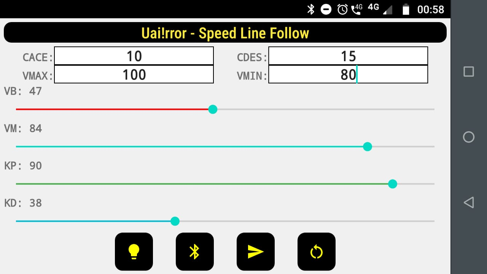
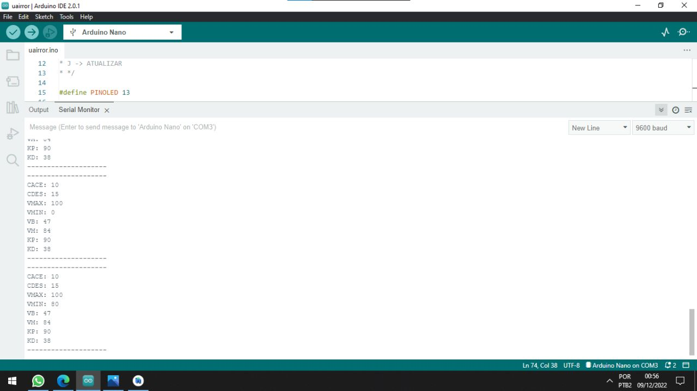

# 🤖 Uai!rror Speed Line Follow 🔥
Aplicativo Android desenvolvido para a equipe de robótica uai!rror para telemetria de robôs seguidores de linha.

## 📋 Sobre
Em geral, robôs seguidores de linha utilizam controle PID e umas das melhores técnicas é testar as constantes em ação, mas sem uma ferramenta que agilize o processo isso se torna tedioso e cansativo (tirando toda a alegria que a robótica proporciona 😄). Pensando nisso, desenvolvi junto a equipe Uai!rror um App Android, que se comunica via bluetooth com o robô, e muda parâmetros internos de sua programação quando o mesmo está correndo em pista. Gostaria de agradecer a <b>Lucas Martins 😎</b> pelo apoio prestado e o empréstimo de materiais, desejo muito sucesso em suas competições.

## 📁 uairror-speed-line-follow-test
Dentro dessa pasta temos o código fonte do arduino, com a finalidade de testar o app.

